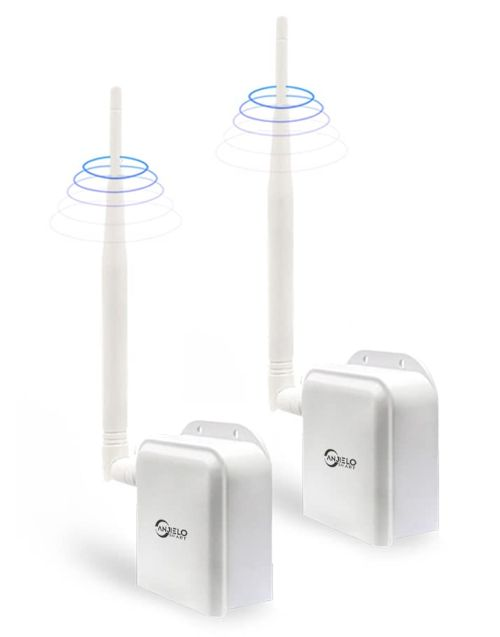
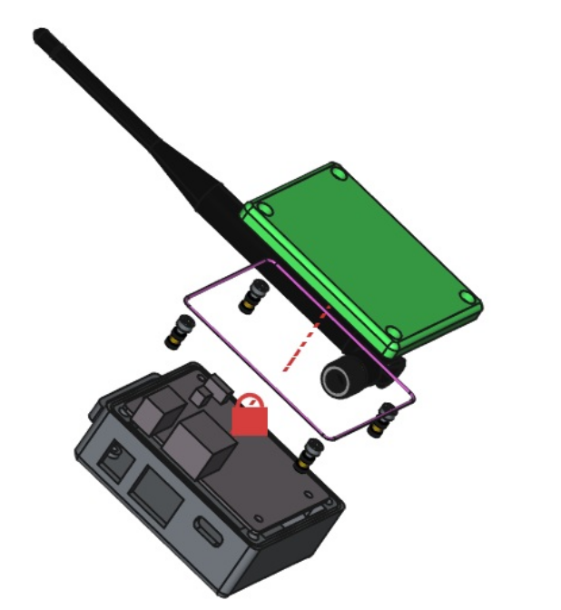

# AH9066 netbridge_v2.1 3d printed case

A simple 3D print case for the AH9066

## Extra Parts
- 4 x hex screw M3x8mm
- 4 x M3 heat insert

Build with Freecad v1.1dev

## License

Copyright (c) 2024 Kostas Gompakis

Licensed under the MIT license.

